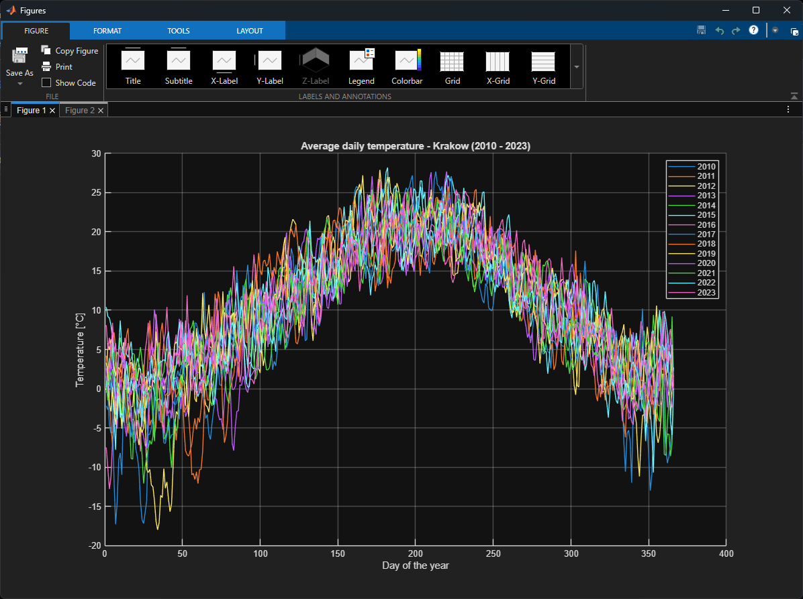
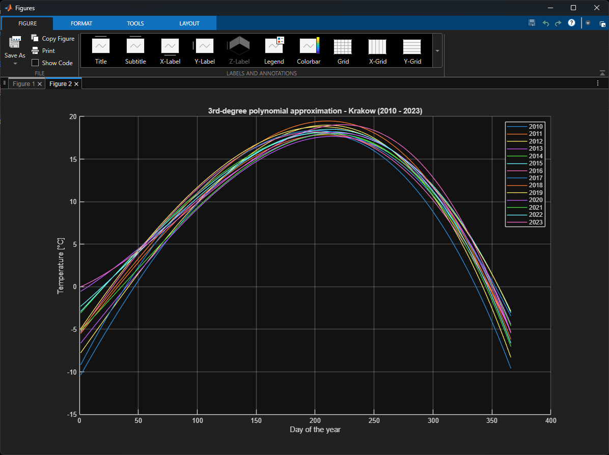

# IMGW Kraków Daily Temperature Analysis

## Project Description and Characteristics

This project focuses on parsing, processing, and visualizing historical meteorological data to analyze climate trends. Specifically, a MATLAB script extracts and processes the average daily temperatures over a 14-year period (2010 - 2023) for the **KRAKÓW-OBSERWATORIUM** weather station. 

The data is sourced directly from the official public datasets provided by the Polish Institute of Meteorology and Water Management (IMGW).
**Data Source:** [IMGW Public Data - Daily Climatology](https://danepubliczne.imgw.pl/data/dane_pomiarowo_obserwacyjne/dane_meteorologiczne/dobowe/klimat/)

**Key Characteristics:**
* **Data Parsing:** The script iterates through 14 years of monthly `.csv` files, dynamically filtering out thousands of records to isolate the data specifically for the Krakow Observatory.
* **Data Format Interpretation:** The algorithm relies on the standard IMGW daily climate data structure:
  * **NSP:** Station code
  * **POST:** Station name
  * **ROK:** Year
  * **MC:** Month
  * **DZ:** Day
  * **TMAX:** Maximum daily air temperature [°C]
  * **WTMAX:** TMAX measurement status
  * **TMIN:** Minimum daily air temperature [°C]
  * **WTMIN:** TMIN measurement status
  * **STD:** Average daily air temperature [°C] *(Target variable used in this project)*
  * **WSTD:** STD measurement status
  * **TMNG:** Minimum daily ground temperature [°C]
  * **WTMNG:** TMNG measurement status
  * **SMDB:** Daily precipitation sum [mm]
  * **WSMDB:** SMDB measurement status
  * **ROOP:** Type of precipitation [S/W/ ]
  * **PKSN:** Snow cover depth [cm]
  * **WPKSN:** PKSN measurement status
* **Status Flags:** The data includes specific status codes where **"8"** indicates a missing measurement and **"9"** indicates the absence of a phenomenon.
* **Visualization & Smoothing:** The project generates a direct plot of the raw data (spaghetti plot) and applies a **3rd-degree polynomial approximation** to model the seasonal temperature curves for each year.

## Example Operation

The images below demonstrate the visual output of the MATLAB script. 

The first figure shows the raw average daily temperatures plotted across 366 days for all 14 years, illustrating the high day-to-day volatility of the weather.

The second figure displays the **3rd-degree polynomial approximation** applied to the datasets. This mathematical smoothing effectively filters out short-term weather noise, revealing the underlying seasonal models. Observing these polynomial curves, a visible upward shift in the seasonal profiles can be noted, indicating an average temperature increase of approximately **2.5°C** over the analyzed 14-year span.

## Software Implementation

A core component of this project is the custom MATLAB script developed to handle the data extraction, loop logic, and mathematical approximations:

* **[`main.m`](main.m):** This main script initializes the environment, loops through the dynamically generated filenames, extracts the specific column (STD) for Krakow, and populates a matrix. It then handles the generation of the two distinct plots, including the mathematical calculation of the `polyfit` and `polyval` functions for the polynomial curves.

## Software Used
* MATLAB 2025b
